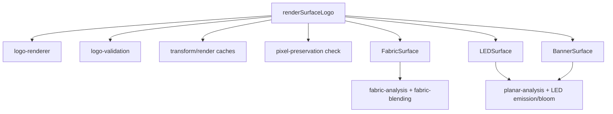

# Imaging Engine V2 — Shared Surface Engine

## Status

The Phase A chest renderer now delegates to a shared surface engine, used for the following non-jersey placements:

- main pitch-side LED board (`LEDSurface`)
- main-stand facade banner (`BannerSurface`)
- training-ground real-photo campaign (`FabricSurface`)

Jersey placements (`chest_sponsor`, `chest_above_name`, `sleeve_left`, `sleeve_right`, `back`, `number`, `shorts`, `socks`) now use the dedicated OpenAI Images Edit pipeline documented in `JERSEY_IMAGE_PIPELINE.md`, not this surface engine. All existing endpoints remain compatible.

## Architecture




## Core modules

- `surface-engine/render-pipeline.ts`: the only render orchestrator. It performs analysis, logo transform, validation, blending, compositing, caching, and outside-ROI preservation checks.
- `surface-engine/types.ts`: common surface contracts and detailed quality metrics.
- `surface-engine/composite.ts`: shared PNG compositing and immutable-pixel validation.
- `surface-engine/planar-analysis.ts`: lightweight illumination/contrast analysis for non-fabric surfaces.
- `surface-engine/adapters/fabric-surface.ts`: wraps the proven Phase A fabric analysis and blending unchanged.
- `surface-engine/adapters/led-surface.ts`: deterministic dark-panel response, LED pixel pitch, restrained bloom, and emissive logo rendering.
- `surface-engine/adapters/banner-surface.ts`: diffuse print response with local illumination preservation.
- `surface-engine/registry.ts`: adapter lookup for fabric, LED, and banner surfaces.
- `hybrid-routing.ts`: declarative registry of which placements/scenes use the V2 engine.
- `composite-hybrid.ts`: shared hybrid composite factory (quality pipeline, debug metadata, storage fields).
- `campaign-placements.ts`: campaign scene definitions including hybrid vs generative mode.
- `hybrid-quality.ts`: one retry and QA policy shared by jersey, stadium, and campaign composites.
- `placement-engine.ts`: cached pixel transforms and surface selection. Domain modules contain coordinates; renderers contain no placement coordinates.
- `hybrid-jersey-renderer.ts` and `hybrid-stadium-renderer.ts`: compatibility/domain wrappers only.

## Data flow

1. Load the requested source lazily.
2. Fetch and preprocess the original sponsor PNG; reuse the processed-logo LRU cache.
3. Resolve a cached placement transform from normalized geometry.
4. Select the configured surface adapter.
5. Analyze only the placement ROI.
6. Transform the exact processed logo through the shared logo renderer.
7. Validate SSIM, perceptual similarity, histogram similarity, color delta, aspect ratio, bounding box, truncation, missing logo, and logo count.
8. Blend according to the surface response.
9. Composite only the ROI and verify every pixel outside it is unchanged.
10. Run OpenAI vision QA in Production/Ultra modes; OpenAI evaluates but never draws deterministic sponsor artwork.
11. Store the PNG and optional debug artifacts.

## API

Existing endpoints and required fields are unchanged:

- `POST /api/media/jersey-mockup`
- `POST /api/media/stadium-mockup`
- `POST /api/media/campaign-creative`

Optional request fields:

```json
{
  "quality_mode": "preview",
  "debug": false
}
```

`quality_mode` accepts `preview`, `production`, or `ultra`. `debug: true` forces debug artifact persistence for that authenticated request.

Hybrid responses additionally expose:

```json
{
  "render_mode": "hybrid-v2",
  "quality_mode": "preview",
  "quality_score": 98,
  "attempt_count": 1,
  "deterministic_validation": {
    "ssim": 0.99,
    "perceptualSimilarity": 0.99,
    "colorHistogramSimilarity": 0.99,
    "renderInstanceCount": 1
  },
  "surface_quality": {
    "lighting": 96,
    "integration": 97,
    "perspective": 96,
    "sharpness": 99,
    "surfaceRealism": 99,
    "logoFidelity": 98,
    "photoPreservation": 100,
    "overall": 98
  }
}
```

## Adding a placement

1. Add or calibrate the normalized ROI in `jersey-placements.ts`, `stadium-placements.ts`, or the future campaign placement registry.
2. Map it to an existing surface adapter in the placement resolver.
3. Add a visual regression case.

No transform, blending, validation, retry, or caching logic should be copied into a domain compositor.

Add a new surface only when its physical response is materially different. Implement the `SurfaceAdapter` contract (`analyze`, `logoOptions`, `strategy`, `blend`, and `summarize`) and register it with a placement resolver.

## Quality and performance report

Controlled preview benchmark, concurrency 1:

| Representative               | Render time |
| ---------------------------- | ----------: |
| Flat-kit sleeve              |      775 ms |
| Main LED board               |    1,783 ms |
| Facade banner                |    1,028 ms |
| Training real-photo campaign |    1,623 ms |

- observed sequential RSS increase: 100.7 MB
- CPU time for four renders: 4,924 ms
- deterministic validation pass rate: 100%
- outside-placement pixel preservation: 100%
- measured structural similarity: 1.000 for the benchmark fixture

Run:

```bash
npm run test:surfaces
npm run test:benchmark
```

## Migration

- Phase A callers continue using `renderHybridJerseyChest`; it is now a compatibility wrapper.
- Domain composites use `runHybridQualityPipeline` and return the existing response fields plus optional V2 metadata.
- `led_board_main` and `main_stand_facade` now preserve the native 1920×1080 stadium source instead of forcing a generative 1536×1024 edit.
- `training_ground` is Mode A (real-photo deterministic rendering). Other campaign scenes remain Mode B (GPT Image) until deterministic post-generation ROIs are available.
- Stadium job provider and inventory labels now reflect hybrid rendering and distinguish banners from LED boards.

## Current limitations and next rollout

- OCR is performed by the existing OpenAI vision QA in Production/Ultra. Offline OCR is deliberately not claimed: no OCR dependency is currently installed, and small distant stadium text is not reliably recognized by generic OCR.
- `renderInstanceCount` is guaranteed by the single-layer deterministic renderer; future post-generation campaign validation still needs connected-component duplicate detection.
- Perspective homography is supported by the shared logo renderer, but each oblique stadium/campaign placement needs calibrated corner geometry.
- Home/player sleeve geometry has not passed representative visual calibration and therefore remains on V1. Only the approved flat-kit sleeve uses V2.
- Static LED/banners are implemented. Curved exterior LED rings, glass, concrete, paint, and metal remain adapter/configuration work.
- Supabase upload still receives a complete PNG buffer. Rendering is memory bounded and queued, but true streaming storage upload remains future work.
- Campaign fan photos referenced under `assets/stadium/fans` are absent in this checkout; affected scenes continue to use documented fallbacks.

The next rollout should add placements as configuration only after one approved visual baseline per source photograph.

Jersey placements have since moved off this V2 surface engine and onto a production-grade OpenAI Images Edit pipeline — see `JERSEY_IMAGE_PIPELINE.md`. The surface engine remains the primary renderer for the stadium LED/facade and training-ground campaign placements listed above.
