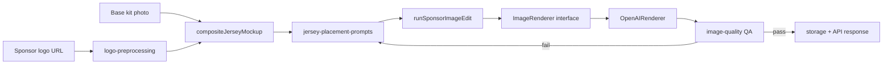

# Jersey Sponsor Mockup Pipeline (Production, OpenAI Images Edit)

## Status

This is the **sole renderer** for all 8 official jersey sponsor placements. There is no deterministic surface-engine fallback and no third-party renderer (SudoMock was evaluated and removed) for jersey mockups. The deterministic surface engine (`docs/IMAGING_ENGINE_V2_SURFACE_ENGINE.md`) remains in use only for stadium LED/facade placements and the training-ground real-photo campaign scene — unrelated to this pipeline.

Placements: `chest_sponsor`, `chest_above_name`, `sleeve_left`, `sleeve_right`, `back`, `number`, `shorts`, `socks`.

## Why OpenAI Images Edit, and why one renderer

Client feedback described earlier deterministic mockups as "flat" — disconnected from the true fold/drape of the fabric. `gpt-image-2`'s Images Edit API, given the base photo and the exact sponsor logo as two separate high-fidelity input images, integrates the mark into real photographic lighting/wrinkles/curvature far more convincingly than a parametric warp. The trade-off (slower, non-deterministic, costs tokens) is accepted in exchange for realism; three-attempt automatic retry with targeted correction prompts keeps failure cases rare.

## Architecture



## Core modules

- `jersey-placement-prompts.ts` — one prompt template per `JerseyPlacementId`. Every template states the source-of-truth contract (Image 1 = base photo, Image 2 = sponsor logo), placement location/scale/behavior pulled from the official sponsorship manual, the logo lock, the preserve-everything-else rule, and physical integration language (curvature, wrinkles, weave, lighting; never pasted/sticker-like). `buildRetryCorrection` maps QA failure phrases (blurry, letters changed, duplicated, cropped, moved, flat/pasted) to a **targeted** correction instruction instead of a generic "try again."
- `image-renderer.ts` — the `ImageRenderer` interface (`render(request): Promise<ImageRenderResponse>`) that all renderers implement, plus the shared `ImageRenderRequest`/`ImageRendererError` types. No call site depends on the OpenAI SDK/HTTP shape directly.
- `openai-renderer.ts` — `OpenAIRenderer`, the current (and only) `ImageRenderer` implementation. Sends the base photo and sponsor logo as two ordered `image[]` entries (never flattened into one file) to `POST /v1/images/edits` with `model: gpt-image-2`, `quality: high`, `input_fidelity: high` (for `gpt-image-2`), `output_format: png`, and the requested `size`.
- `openai-image-pipeline.ts` — `runSponsorImageEdit`: the shared retry loop (max 3 attempts), QA gate (`evaluateSponsorMockup`), and debug/metadata packaging. Renderer-agnostic — it depends only on `ImageRenderer`, so swapping in `DeterministicRenderer`, `FluxRenderer`, `CatVTONRenderer`, or `IDMVTONRenderer` requires only constructing a different renderer and passing it as `input.renderer`; no changes to prompts, retries, or callers.
- `logo-preprocessing.ts` — keeps already-transparent PNGs byte-identical (aside from mandatory upscaling); removes only a uniform solid background (white or colored, detected by border-color sampling + connected-flood-fill) without touching interior artwork pixels; upscales below `MIN_LOGO_LONG_EDGE` (1536px) with Lanczos3; always outputs PNG. Never modifies letters, spacing, proportions, colors, or shapes.
- `jersey-composite.ts` — `compositeJerseyMockup`: validates placement visibility for the chosen kit type, loads the base photo + logo, builds the placement prompt (passing forward the previous attempt's QA issues on retry), and returns the finished `CompositeJerseyResult`.

## Request flow

1. `POST /api/media/jersey-mockup` validates `sponsor_name`, `placement`, `kit_type`, and `quality_mode`, and rejects placements not visible in the chosen kit photo (`isPlacementVisibleForKit`).
2. `compositeJerseyMockup` fetches the base kit photo and sponsor logo in parallel, preprocesses the logo, and calls `runSponsorImageEdit`.
3. For each attempt (max 3): build the placement prompt (with retry correction on attempts 2–3), call `OpenAIRenderer.render()`, verify PNG output, run `evaluateSponsorMockup` (OpenAI Vision QA).
4. On QA failure, the issues are carried into the next attempt's prompt via `buildJerseyPlacementPrompt({ ..., priorIssues })`.
5. On success (or after 3 attempts), the result — buffer, quality report, attempt count, debug artifact — is stored and returned via the unchanged API response shape (`render_mode: "openai-v1"`, `quality_score`, `attempt_count`, etc).

## OpenAI parameters

| Parameter | Value |
| --- | --- |
| Model | `gpt-image-2` (overridable via `OPENAI_IMAGE_MODEL`) |
| Quality | `high` |
| Input fidelity | `high` (all models except `gpt-image-2`, which is fidelity-automatic) |
| Output format | `png` |
| Size | `1024x1536` (portrait, all jersey placements) |
| Images | Two ordered `image[]` entries — Image 1 base photo, Image 2 sponsor logo |
| Mask | Optional; supported by `ImageRenderRequest.mask` but not currently wired per-placement (future work — see Limitations) |

## Retry policy

Up to 3 attempts. On failure, `ImageQualityReport.issues` from the failed attempt are matched against known QA failure phrasing (blurry, letters/typography changed, duplicated, cropped/truncated, moved/overlapping, flat/pasted/sticker-like) and translated into a specific correction appended to the next attempt's prompt. Unmatched issues fall back to a generic "surgical edit" instruction. This is implemented once, in `jersey-placement-prompts.ts#buildRetryCorrection`, and reused by every placement.

## Future renderer swap

To add a new renderer (e.g. a future deterministic engine, Flux, CatVTON, IDM-VTON):

1. Implement the `ImageRenderer` interface (`image-renderer.ts`) — one `render()` method with the same request/response shape.
2. Pass an instance via `runSponsorImageEdit({ ..., renderer: new MyRenderer() })`. Defaults to `OpenAIRenderer` when omitted.
3. No changes needed to prompts, retry logic, QA, placement validation, storage, or the API/frontend contract.

## Testing

```bash
npm run test:jersey-pipeline   # jersey-placement-prompts.test.ts, openai-renderer.test.ts
```

Covers: every placement produces a distinct non-generic prompt; retry attempt 0 has no correction language while later attempts append a targeted correction matched to the failure reason; placement-specific scale/behavior text is present; `OpenAIRenderer` sends exactly two ordered input images and classifies HTTP 429 as retryable via `ImageRendererError`.

## Known limitations / next steps

- Mask-guided editing (`ImageRenderRequest.mask`) is supported by the interface and `OpenAIRenderer` but no placement currently supplies a mask — the model infers the edit region from the prompt's location description alone. A calibrated per-placement mask would tighten edit boundaries further.
- QA (`evaluateSponsorMockup`) still runs at full cost and latency on every attempt; there is no fast deterministic pre-check before the OpenAI Vision call.
- The retry keyword matcher in `buildRetryCorrection` is regex-based on `ImageQualityReport.issues` text. If QA issue phrasing changes materially, keyword patterns should be revisited.
